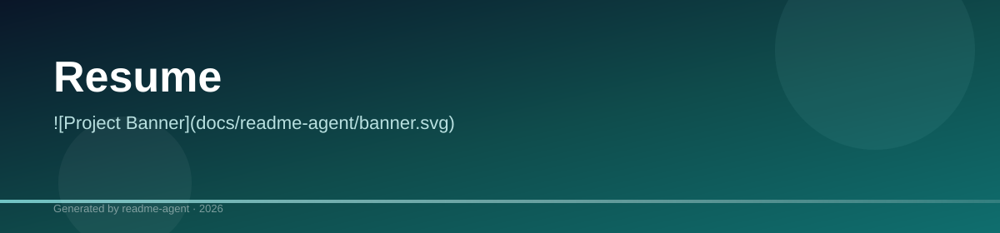

# Resume Repository

A repository containing multiple PDF files of resumes.

## Overview

This repository serves as a collection of PDF files, specifically containing different versions or iterations of a resume belonging to Punya Mittal. It is a static storage location for professional documents and does not contain source code, dependencies, or functional components.

## Features

*   Storage of multiple resume versions

## Project Structure

The project structure consists solely of PDF files in the root directory, representing various versions of the resume.

**Files included:**

*   `Punya_Mittal (1).pdf`
*   `Punya_s_resume (13).pdf`
*   `Punya_s_resume (8).pdf`
*   `Untitled__1_ (3).pdf`

## Limitations

*   The repository contains only static PDF files and lacks any executable code, dependencies, or functional components.

## Usage

Not available in repository

## Tech Stack

Not available in repository

## Setup Guide

### Running the Application

1. **Start the backend** (TTS server on port `8001`)
2. **Start the dashboard** (`npm run dev` in `dashboard/`)
3. Open the dashboard and verify engine status shows **online**

```bash
# Terminal 1 — Backend
cd movio-indicvoice && python -m server.main

# Terminal 2 — Frontend
cd dashboard && npm run dev
```
