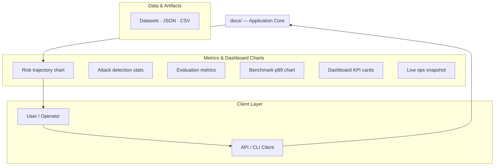
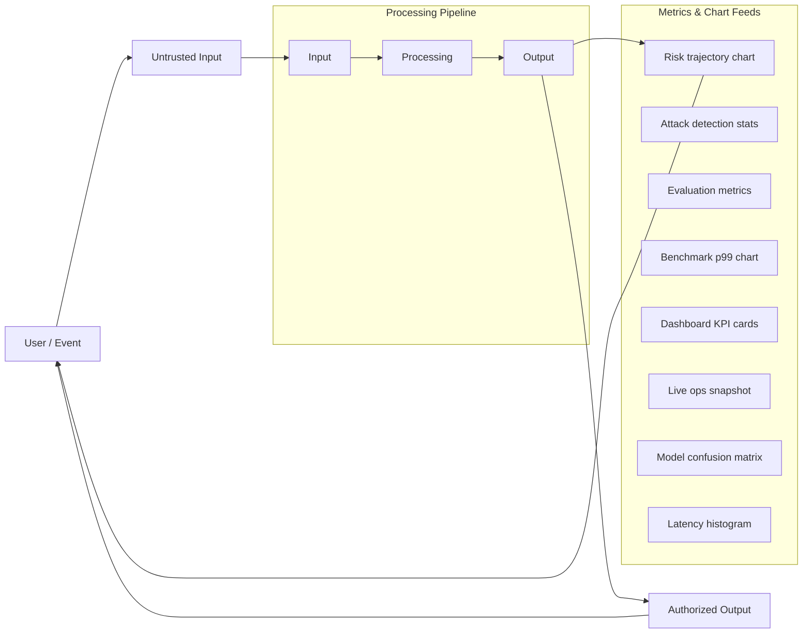
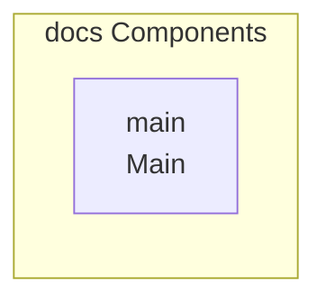

# Project Understanding for Resume Repository

This repository appears to be a collection of resumes and documentation detailing a system architecture for data processing and visualization.

## Overview

The repository contains several PDF files, which appear to be resumes (e.g., Punya_Mittal.pdf, Punya_s_resume.pdf), and a README.md file that describes a complex system architecture. The README details a data flow pipeline and component map, suggesting the project is related to an application core, data processing, and metric visualization, although the actual code for this system is not present in the visible files.

## Key Features

- System architecture design detailing client layer, application core, and data/metrics components.
- Data flow pipeline for processing untrusted input into authorized output.
- Visualization of various metrics and charts, including risk trajectory, attack statistics, and evaluation metrics.

# Resume Repository: System Architecture & Documentation

This repository serves as a comprehensive documentation and design blueprint for a complex data processing and visualization system. It details the system architecture, data flow pipelines, and component maps, although it does not contain the executable source code for the system.

## 🚀 Overview

This repository is a collection of documentation assets and design specifications. It details a system designed to process untrusted input into authorized output while generating various operational metrics and visualizations. The core focus is on defining the data flow pipeline and the component interactions between the client layer and the application core.

## ✨ Features

*   **System Architecture Design:** Detailed mapping of the client layer (User/Operator, API/CLI Client) interacting with the Application Core.
*   **Data Flow Pipeline:** Defines the process for handling untrusted input through a multi-stage processing pipeline to generate authorized output.
*   **Metric Visualization:** Includes specifications for generating various metrics and charts, such as risk trajectory, attack statistics, and evaluation metrics.

## ⚙️ System Architecture

The system is designed with clear separation of concerns, involving a Client Layer, an Application Core, and dedicated components for data and metrics.

### Component Map

This diagram illustrates the high-level interaction between the user/client and the application core.

### Data Flow & Charts Pipeline

This workflow describes how untrusted input is processed and how authorized output and metrics are generated.

### Component & API Map

## 🛠️ Getting Started (Design Blueprint)

**⚠️ Important Note:** This repository contains design documentation and architectural diagrams, not executable source code. Therefore, standard installation and usage steps are not applicable.

### Prerequisites

Not available in repository

### Usage

The system is defined as a blueprint. To implement the described workflow, development must be done based on the architecture diagrams provided.

## 📂 Repository Structure and Contents

This repository contains a mix of documentation and personal documents. Please note the following:

*   **`docs/` directory:** Contains the core technical documentation, including the system architecture diagrams and component maps.
*   **PDF Files:** The presence of multiple PDF files (e.g., `Punya_Mittal.pdf`, `Punya_s_resume.pdf`) suggests that the repository may also serve as a storage location for professional resumes.

## 🚧 Limitations

*   The repository contains no source code, dependencies, or configuration files to implement the described system architecture.
*   The setup guide explicitly states that setup commands could not be extracted, confirming its status as a design specification.

## Setup Guide

_Setup commands could not be extracted from the repository._

## System Architecture

High-level system design, data flows, API map, and workflow pipelines derived from the repository structure.

### System Architecture

### Data Flow & Charts Pipeline

### Component & API Map

